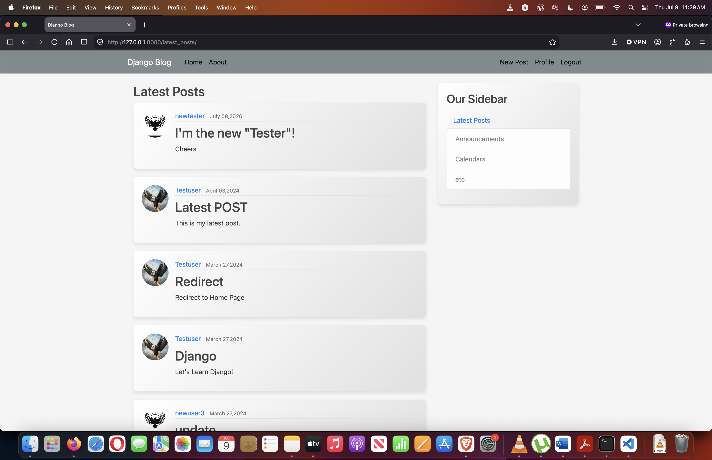
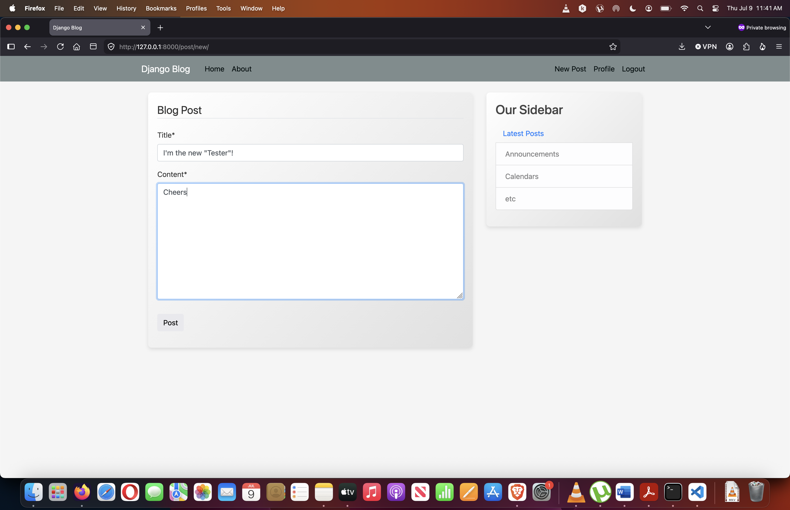
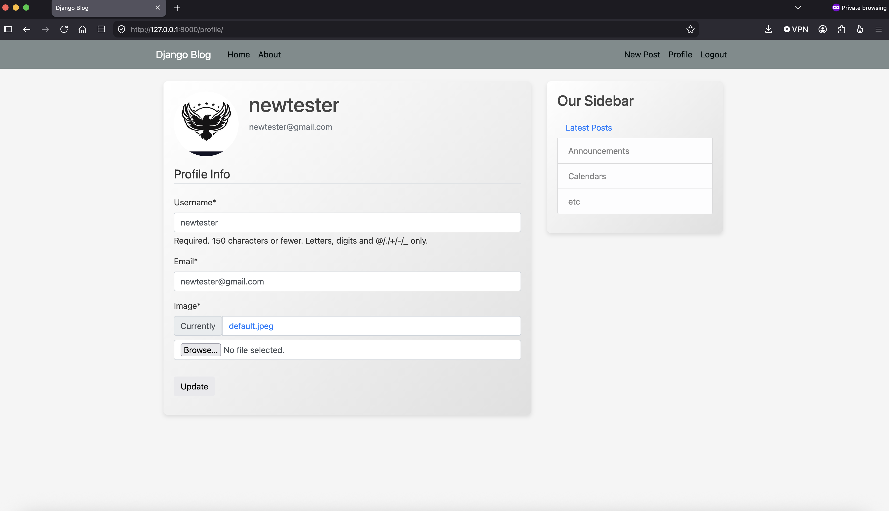

# Django Blog

A full-featured blogging platform built with Django, where registered users can write, edit, and delete posts, manage a personal profile with a custom avatar, and browse posts by author. Includes complete authentication flows — registration, login/logout, and email-based password reset.

## Screenshots

| Home (Post List) | Post Detail / Create | Profile |
|---|---|---|
|  |  |  |

## Features

- 📝 **Blog posts** — create, read, update, and delete posts (title, content, author, timestamp)
- 👤 **Author-only permissions** — only a post's author can edit or delete it
- 📄 **Pagination** — post list is paginated for easy browsing
- 🔍 **User post history** — view all posts by a specific user
- 🔐 **Full authentication** — register, login, logout
- 🖼️ **Profile with avatar** — upload a profile picture, auto-resized (max 300x300px) via Pillow
- 🔄 **Auto profile creation** — a `Profile` is automatically created for every new user via Django signals
- 📧 **Password reset via email** — SMTP-based password reset flow
- 🎨 **Styled forms** — django-crispy-forms with Bootstrap 5 styling
- ℹ️ **About page** and a **latest posts** view

## Tech Stack

- **Backend:** Python, Django 5
- **Database:** SQLite
- **Frontend:** Django templates (HTML), CSS, Bootstrap 5 (via crispy-forms)
- **Image handling:** Pillow (avatar resizing)
- **Email:** Django SMTP email backend (Gmail SMTP) for password reset

## Project Structure

```
django_project/
├── blog/                  # Blog app: posts, views, templates
│   ├── migrations/
│   ├── static/blog/
│   └── templates/blog/
├── users/                 # Users app: profile, auth forms, signals
│   ├── migrations/
│   └── templates/users/
├── django_project/         # Project settings, root URLs, WSGI/ASGI
├── media/                  # Uploaded profile pictures
├── manage.py
└── db.sqlite3
```

## Getting Started

### Prerequisites

- Python 3.11+
- pip

### Installation

1. Clone the repository
   ```bash
   git clone https://github.com/<your-username>/django-blog.git
   cd django-blog
   ```

2. Create and activate a virtual environment
   ```bash
   python3 -m venv venv
   source venv/bin/activate      # macOS/Linux
   venv\Scripts\activate         # Windows
   ```

3. Install dependencies
   ```bash
   pip install django django-crispy-forms crispy-bootstrap5 Pillow
   ```
   > 💡 If you generate a `requirements.txt` (`pip freeze > requirements.txt`), replace this step with `pip install -r requirements.txt`.

4. Apply migrations
   ```bash
   python manage.py migrate
   ```

5. Create a superuser (optional, for admin access)
   ```bash
   python manage.py createsuperuser
   ```

6. Set up email credentials for password reset (optional)

   Add your email credentials as environment variables, or directly in `settings.py` (not recommended for production):
   ```python
   EMAIL_HOST_USER = "your-email@gmail.com"
   EMAIL_HOST_PASSWORD = "your-app-password"
   ```
   > Note: if using Gmail, you'll need an [App Password](https://support.google.com/accounts/answer/185833), not your regular account password.

7. Run the development server
   ```bash
   python manage.py runserver
   ```

8. Visit `http://127.0.0.1:8000/` in your browser.

## Roadmap / Ideas

- [ ] Comments on posts
- [ ] Rich text / Markdown editor for post content
- [ ] Tags/categories for posts
- [ ] Search functionality
